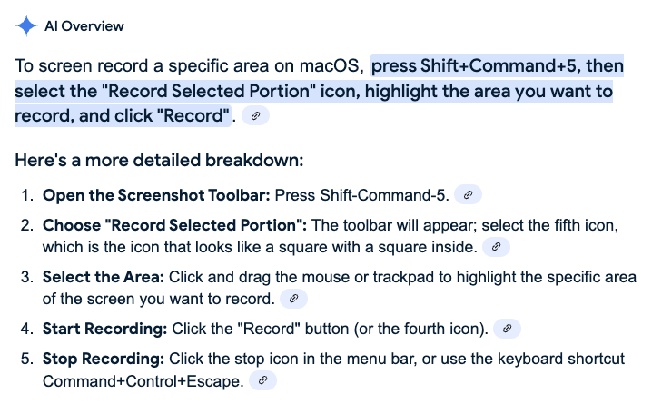

## macOS

This is a pretty succinct explanation:

To screen record a specific area on macOS, press Shift+Command+5, then select the “Record Selected Portion” icon, highlight the area you want to record, and click “Record”.

Here’s a more detailed breakdown:
1. **Open the Screenshot Toolbar:** Press Shift-Command-5.
2. **Choose “Record Selected Portion”:** The toolbar will appear; select the fifth icon, which is the icon that looks like a square with a square inside.
3. **Select the Area:** Click and drag the mouse or trackpad to highlight the specific area of the screen you want to record.
4. **Start Recording:** Click the “Record” button (or the fourth icon).
5. **Stop Recording:** Click the stop icon in the menu bar, or use the keyboard shortcut Command+Control+Escape.

The resulting .mov file is ginormous — wow. a 22 second snippet is 24.2 MB
